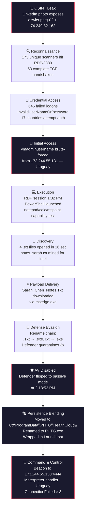

# PRACTICEHunt 03 — Signals Before The Noise

> **External RDP Compromise · PHTG · December 2025**
> A proactive OSINT-driven threat hunt across 5 MDE tables, reconstructing the full kill chain from a leaked LinkedIn photo to in-memory C2.

---

## Engagement Snapshot

| **Engagement Facts** | | **Attack Summary** | |
|---|---|---|---|
| **Target** | LogN Pacific (PHTG subsidiary) | **Initial Access** | Brute-forced default admin via exposed RDP |
| **Asset** | `azwks-phtg-02` (74.249.82.162) | **Threat Actor Origin** | Uruguay (`173.244.55.0/24`) |
| **Hunt Window** | 9 Dec – 23 Dec 2025 (UTC) | **Compromised Account** | `vmadminusername` (local admin) |
| **Platform** | Microsoft Sentinel + MDE | **Payload Family** | Meterpreter (Metasploit Framework) |
| **Tables Used** | DeviceNetworkEvents, DeviceLogonEvents, DeviceProcessEvents, DeviceFileEvents, DeviceEvents | **C2** | `173.244.55.130:4444` (failed) |
| **Trigger** | LinkedIn photo of cloud engineer's workstation | **Persistence** | `C:\ProgramData\PHTG\HealthCloud\PHTG.exe` |
| **Final Score** | 37 of 37 flags solved | **Defender State at Execution** | Passive mode (disabled) |

---

## Kill Chain



---

## Attack Narrative

A PHTG cloud engineer named Sarah Chen posted a casual workstation photo to LinkedIn — visible in the frame was the Azure portal showing the full Properties pane of a virtual machine, including its public IP. The post received 320 likes, 25 comments, and 10 reposts. Within hours, the public IP was being scanned by 173 unique IPs from across the global internet, with 53 of them completing TCP handshakes against the exposed RDP service on port 3389.

Brute-force authentication followed. Across the 14-day hunt window, 646 failed logons were recorded against `vmadminusername` — the host's default-named local administrator account that was never renamed during provisioning. The failure reason was overwhelmingly `InvalidUserNameOrPassword` (637 of 646), the textbook signature of credential cycling. Authentication attempts came from IPs in 17 countries, but only two countries successfully authenticated: the United States (Sarah's legitimate sessions) and Uruguay. The Uruguay traffic originated from a contiguous block of `173.244.55.0/24` — specifically `.131` for the initial successful credential discovery and `.128` for the operator's hands-on-keyboard work that followed.

The operator's interactive RDP session began at 1:32 PM on December 12th. After Windows session-init noise (Edge auto-launch, OneDrive, Defender tray), the first deliberate operator action came at 1:35:54 PM — a `notepad.exe` spawned from PowerShell. Over the next six seconds, `calc.exe`, `mspaint.exe`, and Task Manager all launched the same way, in a rapid capability-testing burst that signaled a human at the keyboard probing what GUI applications they could surface inside the RDP session.

Eleven minutes later, the operator opened four `.txt` files in 16 seconds — flipping through Sarah's notes folder for intelligence. Of the four, `notes_sarah.txt` was the high-value target: an admin's personal working file containing unsanitized scratchpad content. Twenty minutes after that, the operator downloaded a payload via Edge, finalized as `Sarah_Chen_Notes.Txt`. Defender quarantined it three separate times across a rename chain (`.Txt → .exe.Txt → .exe`) between 2:11 and 2:17 PM. At 2:18:52 PM, Defender's operating mode flipped from active to **passive** — at which point Defender continued to *detect* the file but no longer blocked it. The payload, classified by Defender as `Trojan:Win32/Meterpreter`, executed.

The next morning, the operator returned for persistence work. They moved the payload from Sarah's user profile into `C:\ProgramData\PHTG\HealthCloud\` — the legitimate service directory for HealthCloud, a brand-new internal endpoint health service that PHTG had rolled out the same week as the breach. They renamed the file from `Sarah_Chen_Notes.exe` to `PHTG.exe` and wrapped its execution in a batch file (`Launch.bat`) located in the same directory. The blending was deliberate: the HealthCloud rollout was almost certainly accompanied by EDR allowlists, AV exclusions, and admin baselines for that exact directory — every trust configuration that defenders applied to keep the new service from being flagged was inherited by the payload that now lived in the same path.

The payload attempted C2 beaconing on three separate occasions, all to `173.244.55.130:4444` — same /24 as the auth and brute-force IPs, and the default Metasploit Meterpreter handler port. All three attempts logged as `ConnectionFailed`, meaning the operator's listener was either down, taken offline, or blocked at egress. The operator's tradecraft was efficient but not careful: default admin account, default Metasploit payload, default port, neighboring IPs across kill-chain phases.

---

## MITRE ATT&CK Coverage

```mermaid
graph LR
    subgraph Recon["🔭 Reconnaissance"]
        T1595[T1595.001<br/>Active Scanning:<br/>Scanning IP Blocks]
        T1593[T1593.001<br/>Search Open Websites:<br/>Social Media — LinkedIn]
    end

    subgraph CA["🔑 Credential Access"]
        T1110[T1110.001<br/>Brute Force:<br/>Password Guessing]
    end

    subgraph IA["🚪 Initial Access"]
        T1078[T1078.003<br/>Valid Accounts:<br/>Local Accounts]
        T1133[T1133<br/>External Remote Services<br/>RDP exposure]
    end

    subgraph Exec["⚙️ Execution"]
        T1059[T1059.003<br/>Command & Scripting<br/>Interpreter: Windows<br/>Command Shell]
        T1059b[T1059.001<br/>Command & Scripting<br/>Interpreter: PowerShell]
    end

    subgraph DE["🛡️ Defense Evasion"]
        T1562[T1562.001<br/>Impair Defenses:<br/>Disable AV — Passive Mode]
        T1036[T1036.005<br/>Masquerading:<br/>Match Legitimate Name<br/>or Location]
        T1036b[T1036.007<br/>Masquerading:<br/>Double File Extension]
    end

    subgraph Disc["🔎 Discovery"]
        T1083[T1083<br/>File and Directory<br/>Discovery]
    end

    subgraph C2["📡 Command & Control"]
        T1571[T1571<br/>Non-Standard Port<br/>4444/tcp]
        T1219[T1219<br/>Remote Access Software<br/>Meterpreter]
    end

    Recon --> CA
    CA --> IA
    IA --> Exec
    Exec --> DE
    DE --> Disc
    Disc --> C2

    style Recon fill:#1e3a5f,color:#fff
    style CA fill:#5f1e1e,color:#fff
    style IA fill:#5f1e1e,color:#fff
    style Exec fill:#5f3a1e,color:#fff
    style DE fill:#5f1e3a,color:#fff
    style Disc fill:#3a5f1e,color:#fff
    style C2 fill:#1e1e5f,color:#fff
```



---

## Indicators of Compromise

### Network IOCs

| Indicator | Type | Confidence | Context |
|---|---|---|---|
| `173.244.55.130` | C2 IP | **High** | Meterpreter handler, all 3 callbacks |
| `173.244.55.131` | Source IP | **High** | First successful brute-force auth |
| `173.244.55.128` | Source IP | **High** | Operator session source (22 successful auths) |
| `173.244.55.0/24` | CIDR | **High** | Entire attacker /24, host all phases |
| `4444/tcp` | Port | **High** | Default Meterpreter handler — outbound from any workstation = alert |
| Uruguay (geo) | Country | **High** | All attacker infrastructure |

### Host IOCs

| Indicator | Type | Confidence | Context |
|---|---|---|---|
| `224462ce5e3304e3fd0875eeabc829810a894911e3d4091d4e60e67a2687e695` | SHA256 | **High** | Meterpreter payload, all rename forms |
| `C:\ProgramData\PHTG\HealthCloud\PHTG.exe` | File path | **High** | Final persistence location |
| `C:\ProgramData\PHTG\HealthCloud\Launch.bat` | File path | **High** | Wrapper script for payload |
| `C:\Users\vmAdminUsername\Documents\PHTG\Sarah_Chen_Notes.exe` | File path | **High** | Phase 1 staging location |
| `Sarah_Chen_Notes.Txt.crdownload` | File pattern | **Medium** | Browser download artifact |
| `Sarah_Chen_Notes.exe.Txt` | File pattern | **High** | Double-extension staging |

### Identity IOCs

| Indicator | Type | Confidence | Context |
|---|---|---|---|
| `vmadminusername` | Account | **High** | Compromised default-named admin |
| `Trojan:Win32/Meterpreter.RPZ!MTB` | Defender threat name | **High** | AV classification of payload |
| `Trojan:Win32/Meterpreter.gen!E` | Defender threat name | **High** | Variant classification |

---

## Detection Opportunities

Each of the following analytics, if deployed before the incident, would have caught at least one phase of the attack. Together, they would have caught it three times over.

### 1. Geographic anomaly on successful auth — *Catches Phase 04*

```kql
DeviceLogonEvents
| where ActionType == "LogonSuccess"
| where RemoteIPType == "Public"
| where LogonType in ("Network", "RemoteInteractive")
| evaluate ipv4_lookup(GeoTable, RemoteIP, network)
| where country_name !in (dynamic(["United States"]))  // org's operating allow-list
```

**Cost:** trivial. **False positives:** near-zero for single-region orgs. **Signal:** very high.

### 2. PowerShell parent + GUI app child — *Catches Phase 05*

```kql
DeviceProcessEvents
| where InitiatingProcessFileName == "powershell.exe"
| where FileName in~ ("notepad.exe", "calc.exe", "mspaint.exe", "taskmgr.exe", 
                     "regedit.exe", "control.exe")
```

**Cost:** trivial. **False positives:** near-zero (no admin scripts launch calc). **Signal:** very high — this is the capability-testing fingerprint.

### 3. Defender operating-state transition — *Catches Phase 06*

```kql
DeviceEvents
| where ActionType == "AntivirusDetectionActionType"
| extend ReportSource = tostring(parse_json(AdditionalFields).ReportSource)
| where ReportSource has "passive mode"
| summarize FirstPassive = min(TimeGenerated) by DeviceName
```

**Cost:** trivial. **False positives:** legitimate AV transitions are rare and approved. **Signal:** very high — by the time AV is disabled, attackers are already in.

### 4. Service-directory file drop by user account — *Catches Phase 07*

```kql
DeviceFileEvents
| where ActionType in ("FileCreated", "FileRenamed")
| where FolderPath has_any ("C:\\ProgramData\\PHTG\\", "C:\\Program Files\\PHTG\\")
| where InitiatingProcessAccountName != "system"
```

**Cost:** trivial. **False positives:** very low if scoped to known service paths. **Signal:** very high — service directories should only be modified by SYSTEM.

### 5. Outbound to default offensive-tool ports — *Catches Phase 08*

```kql
DeviceNetworkEvents
| where ActionType in ("ConnectionAttempt", "ConnectionSuccess")
| where RemoteIPType == "Public"
| where RemotePort in (4444, 5555, 8080, 1337, 31337)
| where DeviceType != "Server"
```

**Cost:** trivial. **False positives:** very low on workstations. **Signal:** high — default-port C2 is a free win.

---

## Lessons Learned

The single most important takeaway from this hunt is that **every legitimate service rollout is also a blending opportunity for whoever is already inside the environment**. PHTG deployed HealthCloud on December 11th — a brand-new internal service requiring its own service directory under `C:\ProgramData\PHTG\HealthCloud\`. The directory was certainly accompanied by EDR allowlists, AV exclusions, and admin baselines configured to prevent the new service from being flagged. Twenty-four hours later, an attacker dropped a renamed Meterpreter payload into that exact directory and inherited every trust configuration the rollout team had applied. The defensive lift this requires is neither expensive nor technical: file-creation events in service directories should only fire from SYSTEM (the service installer or the service itself). Any user-account-initiated write into a service directory is anomalous by definition. That single analytic, deployed in the days before HealthCloud's rollout, would have caught the persistence handoff cleanly.

The attack chain also illustrates the asymmetry between credential brute-force and successful authentication as detection signals. The 646 failed logons against `vmadminusername` were obvious and noisy — but obvious noise is *not* what you alert on, because exposed RDP guarantees noise-floor brute-force traffic regardless of whether anyone is actually targeting you. The signal that mattered was the *first-ever successful authentication from a country that had never previously authenticated*. That single event, in a single line of KQL, identifies the entire breach with no false positives. The 17-country attempt funnel was just internet weather; the 2-country success funnel was the entire investigation.

Finally, the operator's tradecraft was deliberately efficient rather than careful. Default admin account name. Default Metasploit payload. Default handler port. Brute-force IP and C2 IP in the same /24. None of these would survive an operator with mature OPSEC — but they didn't need to, because PHTG had no detection coverage for any of the phases that matter. **The detections that catch this pattern cost nothing to build.** They cost effort to *think to build* before the breach happens. Every analytic in the Detection Opportunities section is a single KQL query, near-zero false positives, and would have surfaced this attack in real time. The hunt took 37 questions and ~3 hours of investigation to reconstruct after the fact. The detection rules to catch it would take 30 minutes to write and deploy.

---

## Investigation Phases

The full per-question writeups for each phase are available in the corresponding markdown files:

| Phase | Theme | Questions | File |
|---|---|---|---|
| 01 | Public Exposure — What was leaked? | Q00–Q05 | `Part 1 - Mission Brief.md` / `Part 2 - Public Exposure.md` |
| 02 | Scanning Telemetry — Who found it? | Q06–Q10 | `Part 3 - Scanning Telemetry.md` |
| 03 | Authentication Baseline — Who tried to get in? | Q11–Q16 | `Part 4 - Authentication Baseline.md` |
| 04 | Geographic Anomaly | Q17–Q22 | `Part 5 - Geographic Anomaly.md` |
| 05 | Post-Access Behaviour | Q23–Q24 | `Part 6 - Post-Access Behaviour.md` |
| 06 | Payload Staging & Evasion | Q25–Q30 | `Part 7 - Payload Staging.md` |
| 07 | Execution & Persistence | Q31–Q33 | `Part 8 - Execution and Persistence.md` |
| 08 | Command & Control | Q34–Q36 | `Part 9 - Command and Control.md` |
| 09 | The Baseline Was the Cover | Q37 | `Part 10 - Repurposed Baseline.md` |
